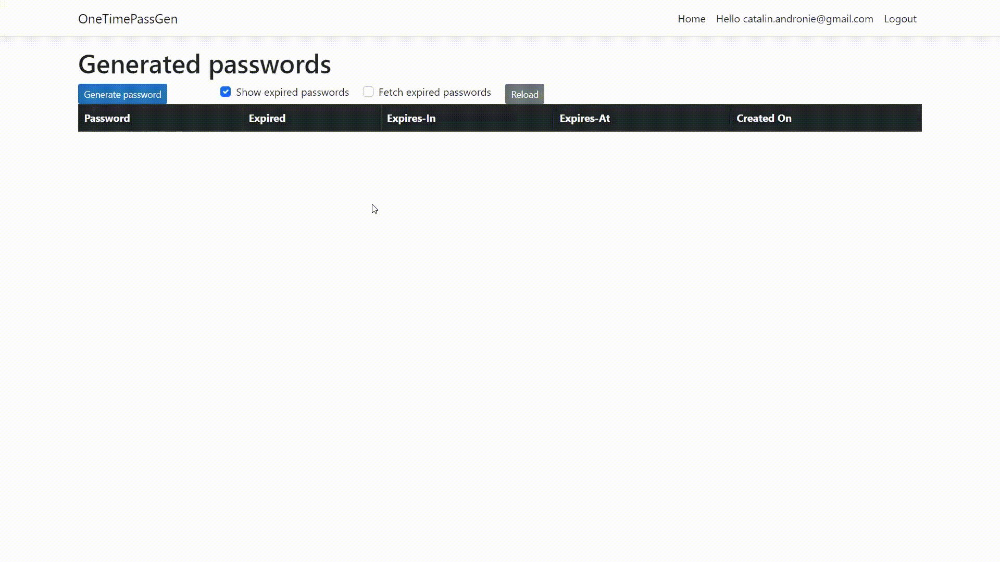

# One-time password generator

`One-time password generator` is an web application which allows authenticated users to generate random passwords which expires at an interval of 30 seconds after creation.



- Build Status:

    [](https://dev.azure.com/CatalinAndronie/OneTimePassGen/_build/latest?definitionId=13&branchName=main)

**Table of contents:**

- [Prerequisites](#prerequisites)
- [Running the solution](#running-the-solution)
- [Build solution](#build-solution)
- [Running tests](#unit-tests)
- [Unit tests](#unit-tests)
- [Integration tests](#integration-tests)
- [Acceptance tests](#acceptance-tests)
- [Code Coverage](#code-coverage)
- [Database commands](#database-commands)

## Prerequisites

- Install latest [NET Core 6 SDK](https://dotnet.microsoft.com/download/dotnet/6.0)
    - Check if *dotnet* is installed by running next command:

    ```cmd
    dotnet --version
    ```

- Restore tools used in development by running next command:

    ```cli
    dotnet tool restore
    ```

## Running the solution

- To run the application execute script:

    ```cmd
    dotnet run --project .\src\Server
    ```

- Open browser at URL <https://localhost:7056> and login or create a new account.

## Build solution

- [Check build runs on CI][CI-link] **--or--**
- On the `root folder` run next command:

    ```cmd
    dotnet build
    ```

## Running all tests

- [Check test runs on CI][CI-link] **--or--**
- On the `root folder` run next command:

    ```cmd
    dotnet cake --task=test
    ```

- The above command will also generated coverage results which can open automatically if option `open-coverage-results` is present:

    ```cmd
    dotnet cake --task=test --open-coverage-results
    ```

## Unit tests

- [Check test runs on CI][CI-link] **--or--**
- On the `root folder` run next command:

    ```cmd
    dotnet cake --task=unit-tests
    ```

## Integration tests

- [Check test runs on CI][CI-link] **--or--**
- On the `root folder` run next command:

    ```cmd
    dotnet cake --task=integration-tests
    ```

## Acceptance tests

- [Check test runs on CI][CI-link] **--or--**
- On the `root folder` run next command:

    ```cmd
    dotnet cake --task=acceptance-tests
    ```

## Code Coverage

- [Check coverage reports on CI][CI-link] **--or--**
- On the `root folder` run next command:

    ```cmd
    dotnet cake --task=code-coverage
    ```

- Generated coverage results are open automatically if option `open-coverage-results` is present:

    ```cmd
    dotnet cake --task=code-coverage --open-coverage-results
    ```

## Database commands

In order to use any of the [ef commands][ef-commands] we need to:

- specify `./src/Infrastructure` as the `--project` (since there we keep the database configurations)
- specify `./src/Server` as the `--startup-project` (since the Server includes the Client)
- and in case of working with `ef migrations add` command, specify `Persistence/Migrations` as the `--output-dir`.

Handy commands:

- `update database`:

    ```cmd
    dotnet ef database update --project ./src/Infrastructure --startup-project ./src/Server
    ```

- `drop database`

    ```cmd
    dotnet ef database drop --project ./src/Infrastructure --startup-project ./src/Server
    ```

- `add migration`:

    ```cmd
    dotnet ef migrations add "MigrationName" --project ./src/Infrastructure --startup-project ./src/Server --output-dir Persistence/Migrations
    ```

- `remove migration`:

    ```cmd
    dotnet ef migrations remove --project ./src/Infrastructure --startup-project ./src/Server
    ```

<!-- Links: -->
[CI-link]: https://dev.azure.com/CatalinAndronie/OneTimePassGen/_build/latest?definitionId=13&branchName=main
